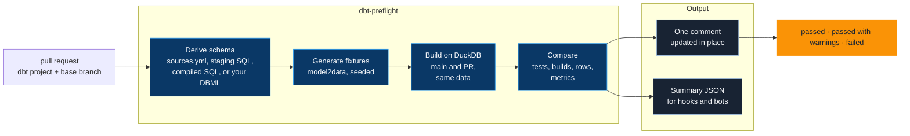

# dbt-preflight

[](https://pypi.org/project/dbt-preflight/)
[](https://pypi.org/project/dbt-preflight/)
[](https://pypi.org/project/dbt-preflight/)
[](https://github.com/JB-Analytica/dbt-preflight/actions/workflows/ci.yml)
[](https://github.com/JB-Analytica/dbt-preflight/blob/main/LICENSE)

Built and maintained by [JB Analytica](https://www.jbanalytica.com/?ref=dbt-preflight) — data platform architecture and analytics engineering.

**CI for dbt pull requests that needs no warehouse.**

On every pull request, preflight generates synthetic source data from your schema, builds
the models the change reaches on DuckDB, once from `main` and once from the pull request, on
that same data, compares them, and leaves one comment: what broke, which numbers moved, and
what it could not check. No warehouse credentials anywhere. Free and open source (MIT), and
measured on every release against five public dbt projects.


*A pull request that counts cancelled orders in customer lifetime value. Every test passes.
The comment shows what the tests did not: lifetime value up 4.6%, and by how much per
segment.*

```yaml
# .github/workflows/preflight.yml
name: dbt preflight
on:
  pull_request:

permissions:
  contents: read
  pull-requests: write

jobs:
  preflight:
    runs-on: ubuntu-latest
    steps:
      - uses: actions/checkout@v4
      - uses: JB-Analytica/dbt-preflight@v0
```

Or try it locally first, on a branch: `uvx dbt-preflight run --base-ref origin/main`.

> **Want it set up for your team?** The Action is free and stays open source. Getting the
> most from it on a real project is mostly about the parts around it: a source schema that
> behaves like your business, the conventions your team actually follows, metrics worth
> comparing, and instructions that keep coding agents inside them.
> [JB Analytica](https://www.jbanalytica.com/how-we-work/?ref=dbt-preflight) sets that up
> with your team and hands it over, so your engineers run it without us afterwards.
> [Book a 30-minute call](https://calendar.app.google/8gdDatFU3WQp5s71A) or write to
> [jarich@jbanalytica.com](mailto:jarich@jbanalytica.com).

---

## What you get

**What broke, and what it breaks.** Renamed columns, dropped `ref()`s and broken joins, with
the unchanged models the change breaks named, and DuckDB's error read into plain English
(*the input no longer has a column called `email`*). Each failing test folds the compiled
SQL that failed under it. Schema tests and dbt unit tests both run.
→ [Recorded scenarios](https://github.com/JB-Analytica/dbt-preflight/blob/main/docs/scenarios/README.md)

**The numbers that moved.** A change no test covers still shows up: rows whose values
differ, columns added, removed or retyped, row counts, and every metric the project defines,
before and after, overall and per segment. Metrics are read from dbt's semantic layer,
Lightdash `meta.metrics`, or a `metrics:` list in the config.
→ [Metrics](https://github.com/JB-Analytica/dbt-preflight/blob/main/docs/configuration.md#metrics-from-wherever-the-project-defines-them)

**Judged against `main`.** Both branches run the same tests on the same data, and only new
or worse failures count: ⚠️ *Broken on main too* does not fail the pull request, ❓ *Could
not be checked* does. When in doubt, the pull request answers for it.
→ [How it works](https://github.com/JB-Analytica/dbt-preflight/blob/main/docs/how-it-works.md)

**Works on a project as it is.** With no schema file, the source schema is derived from
`sources.yml`, the staging SQL and dbt's compiled SQL, so sources read through Fivetran's
macros are found. A column no SQL types is guessed from its name and flagged, never silently.
→ [Where the schema comes from](https://github.com/JB-Analytica/dbt-preflight/blob/main/docs/configuration.md#where-the-schema-comes-from)

**The same data, every run.** Fixtures come from
[model2data](https://github.com/JB-Analytica/model2data): relationship-preserving, cast to
the declared types, and seeded. Same schema, same seed, same data.
→ [`.dbt-preflight.yml`](https://github.com/JB-Analytica/dbt-preflight/blob/main/docs/configuration.md#dbt-preflightyml)

**Your warehouse's SQL, on DuckDB.** A model DuckDB rejects as written is transpiled from the
project's dialect (BigQuery, Snowflake, ...) with sqlglot. One that still fails because
DuckDB lacks something is reported as *not verified*, not as broken.
→ [Warehouse SQL on DuckDB](https://github.com/JB-Analytica/dbt-preflight/blob/main/docs/configuration.md#your-warehouses-sql-on-duckdb)

**A schema you can keep.** `dbt-preflight schema` writes what a run derived as a DBML file
to commit, with a note on every column whose type was guessed.
→ [Keeping the schema](https://github.com/JB-Analytica/dbt-preflight/blob/main/docs/configuration.md#keeping-the-schema)

**House conventions, opt-in.** Naming, layering, a tested primary key, descriptions and
column names, checked on the changed models: warnings by default, errors once opted in.
→ [Conventions](https://github.com/JB-Analytica/dbt-preflight/blob/main/docs/configuration.md#conventions)

**A feedback loop for coding agents.** An agent that runs preflight before opening a pull
request gets every finding with a file path, the downstream models a rename touches, and the
metrics its "no behaviour change" refactor moved.
→ [Using preflight from a coding agent](https://github.com/JB-Analytica/dbt-preflight/blob/main/docs/agents.md)

**One comment, and JSON for a hook.** The comment opens with a verdict (**passed**, **passed
with warnings** or **failed**) and one line that sums up the change, and is updated in place
on every push. `--summary-file` writes the same findings as JSON.
→ [Integrating preflight](https://github.com/JB-Analytica/dbt-preflight/blob/main/docs/integration.md)

---

## Before and after

In: a pull request that drops one line from `dim_customers`, so cancelled orders count
towards customer lifetime value. No test covers it.

```diff
 orders as (

     select * from {{ ref('stg_webshop__orders') }}
-    where order_status != 'cancelled'

 ),
```

Out: the comment. Every test passes, so the verdict is **passed**, and the numbers say what
changed:

> No new failures · moves 3 metrics (Average lifetime orders +4.8%) · touches 3 marts
>
> **`dim_customers`** — rows 150 (unchanged) · 30 rows with different values (20%)
>
> | Metric | Base | PR | Δ |
> | --- | ---: | ---: | ---: |
> | Average lifetime orders | 4.72 | 4.95 | +4.8% |
> | Total lifetime value | 73,285.32 | 76,677.25 | +4.6% |
> | Average lifetime value | 488.57 | 511.18 | +4.6% |

In: a pull request that renames `email` to `email_address` in the source schema and leaves
the staging model alone. Out: a failed check, naming the model that broke and the mart it
takes with it.


Six pull-request shapes, four that must fail and two that must pass, are recorded with the
full comments they produced in
[docs/scenarios](https://github.com/JB-Analytica/dbt-preflight/blob/main/docs/scenarios/README.md).

---

## Who it's for

A staging model renames a column, every test passes, and the first sign of trouble is a
dashboard that is wrong three days later, and more of those changes are now written by
coding agents. The honest check is to run the change on data, but
the data lives in a warehouse whose credentials most teams will not put in CI. dbt Cloud's CI
jobs and data-diff tools run against that warehouse, so they need access to it. Preflight
needs none: the data is synthetic, and the warehouse is a DuckDB file that lives for the
length of the job.

- **A team that will not put warehouse credentials in CI.** Preflight writes its own
  `profiles.yml`, so the project's real profile is never used to connect and its credentials are never read.
- **A reviewer of a refactor that should change nothing.** The comment shows whether any
  row, column or metric moved, before anyone has to reason about the SQL.
- **A team letting coding agents change the dbt project.** The agent runs preflight before
  it opens the pull request and fixes what the comment reports.
- **A project built on Fivetran's or other packages.** Sources that only appear in compiled
  SQL are still found; Fivetran's Shopify package runs without a hand-written schema.
- **A consultant who gets the client's code but never their data.** Every check runs on
  synthetic data generated from the schema.

---

## How it works



1. **Parse.** `dbt parse` on the pull request, and on the base branch in a temporary
   worktree; `dbt ls --select state:modified` finds what changed.
2. **Generate.** model2data generates data for every source table from the schema (your
   DBML file, or the one derived from the project), cast to the declared types and loaded
   into a DuckDB file.
3. **Transpile.** Each compiled model DuckDB does not accept as written is transpiled from
   the project's dialect with sqlglot.
4. **Build.** The selection is closed over downstream models, models whose tests read a
   changed model, and all their ancestors, and `dbt build` runs on it. Conventions are
   checked on the changed models.
5. **Compare.** The changed models and everything downstream are built on the base branch
   too, into their own schemas on the same fixtures, and compared: test results, builds,
   columns, row counts, differing rows and metric values.
6. **Comment.** One Markdown comment, posted or updated through the GitHub API.

### What counts against the pull request


A model that fails the same way on `main` leads the comment under ⚠️ *Broken on main too*
and does not fail the pull request. Tests synthetic data can never satisfy fail on both
branches, so they are folded under *Already failing on the base branch*.


When preflight cannot tell whether the change broke a model, it says so and counts it
against the pull request: ❓ *Could not be checked*. That happens when a model the change
reaches is already broken on `main` (DuckDB reports only the first error, so a new one can
hide behind it), or fails on data preflight had to guess. A model the change does not reach
builds from identical SQL on identical data on both sides, so a failure there is only a
warning. The full rules are in
[docs/how-it-works.md](https://github.com/JB-Analytica/dbt-preflight/blob/main/docs/how-it-works.md).

---

## Works on projects we didn't write

Five public dbt projects, in six setups, are pinned to a commit and run through a harmless
change and a column rename. Every release is measured against them, and a weekly workflow
runs them again. The results as of 0.5.0:

| Project | Setup | Harmless change | Column rename |
| --- | --- | --- | --- |
| [dbt-labs/jaffle_shop](https://github.com/dbt-labs/jaffle_shop) (classic) | Seeds only, no config file | Passes with warnings, 5 of 5 models built | Caught |
| [dbt-labs/jaffle-shop](https://github.com/dbt-labs/jaffle-shop) | Sources without declared columns, no config file | Passes with warnings, 8 of 8 built | Caught |
| [fivetran/dbt_shopify](https://github.com/fivetran/dbt_shopify) | No schema file: derived through Fivetran's macros | Passes with warnings, 52 of 52 built | Caught |
| [mattermost-data-warehouse](https://github.com/michaelschiffmm/mattermost-data-warehouse) (fork) | Snowflake, in a subfolder, `env:` set | Fails: 1 model could not be checked, 7 of 10 built | Caught |
| fivetran/dbt_shopify | BigQuery, hand-written DBML schema | Fails: 45 of 49 built; 4 models the change reaches sit behind 2 that preflight's data cannot build | Caught |
| [Velir/dbt-ga4](https://github.com/Velir/dbt-ga4) | BigQuery, GA4 nested records | Fails: nothing builds yet (BigQuery `partition_by`) | Not caught |

The failures stay in the table, because they say where the edges are. The mattermost
failure is the *Could not be checked* comment above. The hand-written Shopify schema types
`parent_id` as text, so two models cannot be built on its data; preflight says so, and
counts the four models behind them that the change reaches instead of excusing them.
dbt-ga4 is a known gap. No model in the suite has been reported *not verified* for SQL
DuckDB could not run.

Shopify without a schema file is the hard case: Fivetran's staging models select their
columns through macros such as `fill_staging_columns`, so the source columns are not in the
raw SQL at all. Since 0.5.0 preflight reads them from dbt's compiled SQL. A column no SQL
types is guessed from its name and flagged in the comment, and a column the SQL reads as
JSON gets valid JSON in its fixture. On these projects a run takes 7 to 48 seconds, the
Shopify package included.

The suite, its pinned commits and its baseline are in
[scripts/realworld](https://github.com/JB-Analytica/dbt-preflight/blob/main/scripts/realworld/README.md).

---

## Installation

As a GitHub Action, in the workflow at the top of this page:

```yaml
- uses: JB-Analytica/dbt-preflight@v0        # follows the latest 0.x release
- uses: JB-Analytica/dbt-preflight@v0.5.2    # or pin an exact version
```

As a CLI, to run locally or in another CI:

```bash
uvx dbt-preflight run --base-ref origin/main    # or: uv tool install / pipx install / pip install dbt-preflight
uvx dbt-preflight schema                        # write the derived schema as DBML
```

Python 3.10 to 3.13. Preflight brings its own dbt-core (1.11 or newer, below 2) and
dbt-duckdb, so the project must parse on dbt-core 1.11 or newer; its own warehouse adapter
is not needed.

Without `--base-ref`, every model counts as changed and the whole project is built.
`--comment-file preflight.md` writes the comment to a file instead of stdout,
`--summary-file` writes the JSON, and `--keep-workdir` leaves `.preflight/` (fixtures,
DuckDB file, dbt artefacts) behind for inspection. Every flag and the exit code are in
[docs/integration.md](https://github.com/JB-Analytica/dbt-preflight/blob/main/docs/integration.md).

---

## Configuration

A project at the repository root often needs no config file at all. Add a
`.dbt-preflight.yml` when the project sits in a subfolder, when its SQL is written for a
warehouse and no `profiles.yml` is checked in, or when its `sources.yml` reads environment
variables:

```yaml
project_dir: transform/dbt   # folder holding dbt_project.yml
dialect: snowflake           # transpile Snowflake SQL to DuckDB
env:
  SNOWFLAKE_DATABASE: preflight
```

Every key is optional:

| Key | Default | What it sets |
| --- | --- | --- |
| `project_dir` | `.` | Folder holding `dbt_project.yml` |
| `schema` | derived from the project | DBML file describing the source tables |
| `rows` / `rows_for` | `200` / none | Rows per source table, and per-table overrides |
| `seed` | `42` | Same seed, same data, every run |
| `locale` | model2data's default | Faker locale for names and addresses |
| `env` | none | Environment variables `profiles.yml` or `sources.yml` expect |
| `vars` | none | dbt vars, passed to every dbt command as `--vars` |
| `dialect` | read from a checked-in `profiles.yml` | SQL dialect to transpile from (`bigquery`, `snowflake`, ...) |
| `dialect_failures` | `warn` | Whether a model DuckDB cannot run fails the check (`error`) |
| `metrics` | none | Extra metrics to compare: `name`, `model`, aggregate `sql` |
| `conventions` | `jba` rules as warnings | Opt in to the convention rules as errors, or adjust them |
| `check_all` | `false` | Check conventions on every built model, not only changed ones |
| `loader_columns` | dlt's `_dlt_load_id`, `_dlt_id` | Columns a loader adds to every table |

The full reference, with the action's inputs and examples, is in
[docs/configuration.md](https://github.com/JB-Analytica/dbt-preflight/blob/main/docs/configuration.md).

---

## model2data studio, for the source schema

A derived schema is a starting point that preflight rebuilds on every run. When it had to
guess a type, the comment says so in one line. To make the data behave like your business,
keep the schema and refine it in
[**model2data studio**](https://studio.jbanalytica.com/?ref=dbt-preflight-readme), JB
Analytica's browser editor for the engine that generates preflight's fixtures:

- **Start from what preflight derived.** `dbt-preflight schema` writes
  `source_system/<project name>.dbml`; point `schema:` at it and commit it. Paste it into
  the studio's editor, or open the repository as a repository project.
- **See the guesses.** Every column `sources.yml` did not type carries a note saying where
  its type came from. Check the column, then delete the note.
- **Shape the data.** Weighted statuses, null rates and skewed keys set in the studio carry
  through to the fixtures preflight builds on.

Free to start, nothing to install. The Action and the CLI stay where the check runs; the
studio is where the schema gets designed.

---

## Documentation

- [Configuring preflight](https://github.com/JB-Analytica/dbt-preflight/blob/main/docs/configuration.md) — the Action's inputs, `.dbt-preflight.yml`, where the schema comes from, warehouse SQL, metrics, conventions
- [How preflight works](https://github.com/JB-Analytica/dbt-preflight/blob/main/docs/how-it-works.md) — a run step by step, and what counts against a pull request
- [Integrating preflight](https://github.com/JB-Analytica/dbt-preflight/blob/main/docs/integration.md) — flags, exit code, the summary JSON, a pre-pull-request hook
- [Using preflight from a coding agent](https://github.com/JB-Analytica/dbt-preflight/blob/main/docs/agents.md) — the instruction block for `CLAUDE.md` or `AGENTS.md`
- [Recorded scenarios](https://github.com/JB-Analytica/dbt-preflight/blob/main/docs/scenarios/README.md) — six pull requests and the comments they produced
- [The real-world suite](https://github.com/JB-Analytica/dbt-preflight/blob/main/scripts/realworld/README.md) and the [changelog](https://github.com/JB-Analytica/dbt-preflight/blob/main/CHANGELOG.md)

---

## Design decisions / non-goals

- **Synthetic data, never production.** Fixtures come from the schema alone. Preflight
  writes its own `profiles.yml` and runs on it, so no credentials are needed, and `~/.dbt`
  is never read.
- **DuckDB.** A file that lives for the length of the job, built fresh on every run. DuckDB
  gets the first word: only a model it rejects is transpiled.
- **Base and pull request on the same data.** The comparison is `main` against the pull
  request, not production against the pull request, so a difference was caused by the
  change and nothing else.
- **When in doubt, the pull request answers for it.** A failure preflight cannot put down to
  `main` counts against the change.
- **One comment, updated in place,** not a stack of them.
- **Conventions are opt-in.** Without a `conventions:` block they are warnings: a project
  never signs up for anyone's conventions just by writing a config file.
- **Non-goal: a diff against production.** Preflight never touches production data.

---

## Limitations

- **Production numbers are not proven unchanged.** Synthetic data shows that the logic
  changed and how, not the size of the effect on real data. A metric that does not move on
  the fixtures can still move on production.
- **SQL DuckDB cannot run.** Warehouse SQL is transpiled to DuckDB with sqlglot; a model
  that still fails because DuckDB lacks something is reported per model as *not verified*,
  not as broken.
- **Some warehouse-only configs.** dbt-ga4's BigQuery `partition_by` currently stops the run.
- **Incremental behaviour across runs.** Every run is a full build on a fresh file.
- **Invariants across columns.** The generated data respects the types, keys, foreign keys
  and accepted values it knows about, not rules such as "shipped after ordered". Tests that
  rely on one fail on both branches and are folded as already failing.

---

## Project status

dbt-preflight is at 0.x and actively developed. The real-world suite above runs weekly and
before every release, and the
[changelog](https://github.com/JB-Analytica/dbt-preflight/blob/main/CHANGELOG.md) says what
each release changed in the comment and the summary JSON.

Ideas still open:

- Incremental models checked across days, with model2data's day-by-day batches.
- Metrics checked against known values, and GitLab merge requests.

---

## Contributing

Bugs and feature requests belong in
[the issue tracker](https://github.com/JB-Analytica/dbt-preflight/issues). A pull request
is welcome:

```bash
uv sync --extra dev
uv run poe check          # ruff, ty, pytest
```

`poe check` has to be green and, if you change what the comment says,
`uv run python scripts/scenarios.py` re-records the six scenarios so the change shows up in
`docs/scenarios/`. `uv run poe realworld --compare` runs the real-world suite (it needs
network).

---

## Licence

MIT. See [LICENSE](https://github.com/JB-Analytica/dbt-preflight/blob/main/LICENSE).

---

<p align="center">
  <a href="https://www.jbanalytica.com/?ref=dbt-preflight">
    
  </a>
  <br>
  Built and maintained by <a href="https://www.jbanalytica.com/?ref=dbt-preflight"><strong>JB Analytica</strong></a> —
  Data & Analytics Engineering · Data Platform Architecture · Modern BI.
  <br>
  Synthetic data from <a href="https://github.com/JB-Analytica/model2data"><strong>model2data</strong></a>; design the schema behind it in <a href="https://studio.jbanalytica.com/?ref=dbt-preflight-readme"><strong>model2data studio</strong></a>.
</p>
